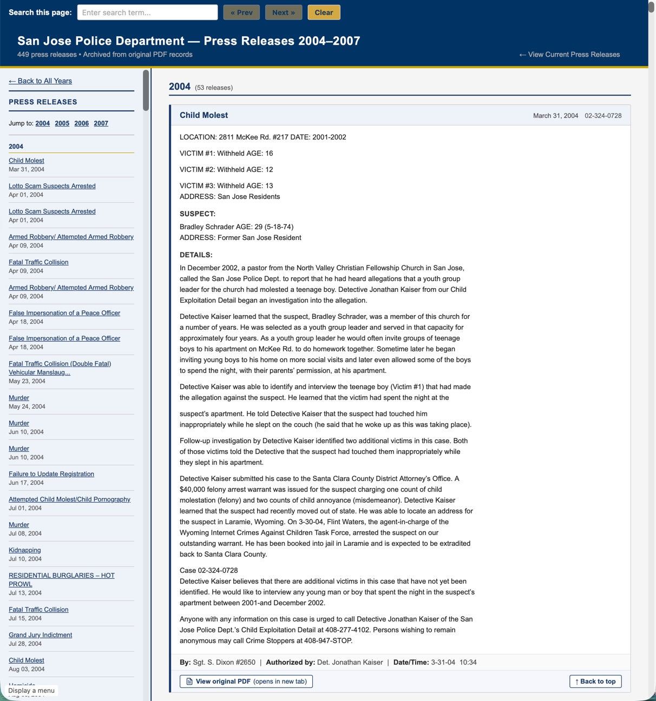

# PDF Press Release Archive Converter

A Python script that converts a collection of semi-structured PDF documents into a single, navigable HTML archive page. Originally developed to preserve several hundred police department press releases from 2004–2007, the approach is adaptable to any organization that has a backlog of older PDFs with loosely consistent formatting.

## What This Does

The script reads every PDF in a folder, extracts the text, parses out a title, date, author metadata, and body content, then generates one self-contained HTML page with:

- A sticky sidebar navigation with year-based grouping and jump links
- Individual "cards" for each document showing headline, date, case number, full body text, and a link to the original PDF
- WCAG 2.1 AA accessibility features (skip links, focus indicators, ARIA labels, sufficient color contrast)
- A versioned footer with the generation date
- Print CSS that hides navigation

The output HTML sits alongside a `pdfs/` subfolder containing the original files, so every transcript links back to its source document.

## Why This Exists

Many organizations have years of PDF documents published on legacy websites or stored on shared drives. These PDFs are often:

- Difficult or impossible to search across as a collection
- Inaccessible to screen readers (especially older scanned or poorly structured files)
- Hosted on platforms that may be decommissioned

Converting them to a single HTML page makes the content searchable, accessible, and portable. The original PDFs are preserved alongside the HTML for reference.

## Requirements

**Python 3.8+** with the following libraries:

```
pip install pdfplumber pypdf beautifulsoup4
```

> **Note on BeautifulSoup:** This dependency was added during iterative refinement (see the development history below). It is used for HTML sanitization of the output, specifically for fixing unclosed tags and cleaning up malformed markup that accumulated as the body-to-HTML conversion grew more complex. If your version of the script does not yet include BeautifulSoup-based cleanup, install it early — you will almost certainly need it.

`pdfplumber` handles the primary text extraction. `pypdf` serves as a fallback extractor (some PDFs that fail with one library succeed with the other) and also reads PDF metadata for date extraction.

## Quick Start

1. Place all your PDF files in a single folder (e.g., `C:\project\pdfs\`).
2. Edit the configuration block at the top of the script:

```python
PDF_DIR      = r"C:\project\pdfs"
OUTPUT_FILE  = r"C:\project\output\home.html"
PDF_SUBDIR   = "pdfs"
```

3. Run the script:

```
python convert_press_releases.py
```

4. Copy (or symlink) the `pdfs/` folder so it sits next to `home.html` in the output directory. The generated page links to each PDF via a relative path like `pdfs/filename.pdf`.

The script prints progress for every file and a summary of any warnings at the end.

## How It Works

### Text Extraction

Each PDF is opened with `pdfplumber`. If that yields no text (common with scanned-image PDFs), `pypdf` is tried as a fallback. All pages of the document are concatenated into a single text block. This is important — many of these press releases had meaningful content on page 2 that would be lost if only the first page were read. See the development history for more on how multi-page handling was discovered and addressed.

### Date Extraction (Priority Cascade)

The script uses a four-level fallback strategy to determine the document date. The priority order was refined over many iterations to maximize accuracy against the actual document corpus:

1. **Footer date field** — Many press releases include a structured footer block like `BY: Sgt. Smith  AUTHORIZED BY: Lt. Jones  DATE: 4-9-04  TIME: 9:30AM`. The DATE field in this block is the most authoritative because it represents the actual release date. The script parses both single-line and multi-line variants of this footer.

2. **Spelled-out date in body text** — Dates written in natural language (e.g., "October 27, 2004") found in the body of the document. These typically appear near the top of the narrative and represent the event or release date.

3. **Filename case number** — Filenames following the pattern `YY-JJJ-NNNN` (two-digit year, Julian day, sequence number) encode an incident date. This is less preferred because the incident date can precede the press release by days or weeks. A Julian day conversion function handles the translation. A year-clamping heuristic prevents two-digit years from the 1990s from being interpreted as the 2090s.

4. **PDF metadata** — The `CreationDate` or `ModDate` fields embedded in the PDF file properties. This is the least reliable because metadata dates often reflect when the PDF was generated or copied rather than when the content was authored. Dates outside a plausible range (before 1994 or after 2010, in this case) are rejected.

If none of these methods produce a date, the record is flagged with a `DATE NOT FOUND` warning and sorted to the end of the archive.

### Title Extraction

Title extraction handles two common PDF layouts:

- **Standard layout:** A "PRESS RELEASE" header appears near the top, and the headline follows below it.
- **Inverted layout:** The "PRESS RELEASE" header appears in the bottom half (common in a particular template variant). In this case, the title is found near the top of the page, before structured fields like `TYPE OF CRIME` or `WHO/WHAT/WHEN/WHERE`.

The script scans for a `TYPE OF CRIME` field and uses its value as the title when no better headline candidate is found. Lines matching known boilerplate patterns (department address, phone/fax numbers, statutory disclaimers) are excluded from title consideration.

### Body Text Cleanup

The body extraction pipeline strips:

- Boilerplate header blocks (department name, address, phone numbers)
- Footer metadata blocks (`BY:` / `AUTHORIZED BY:` / `DATE:` / `TIME:`)
- Repeated page headers and footers from multi-page documents
- Page number lines (`Page 2`, `Page 2 of 3`)
- Duplicate title lines that reappear on subsequent pages

A paragraph-break injection pass attempts to restore paragraph boundaries. PDFs extracted as plain text often produce a wall of continuous lines with no blank lines between paragraphs. The script inserts breaks when a line ends with sentence-terminal punctuation and the next line begins with a capital letter (but not a common continuation word like "and", "the", or "however"). Breaks are also inserted before recognized section labels like `DETAILS`, `UPDATE`, `SUSPECT #1`, etc.

### HTML Output

Body text is converted to HTML paragraphs. Lines within a paragraph are joined with `<br>` tags. Recognized section labels (all-caps headings like `DETAILS:` or `WHO:`) are rendered with a distinct CSS class for visual separation.

Each press release card includes:

- The extracted title, date, and case number in a header bar
- The full body text
- A metadata footer showing BY, AUTHORIZED BY, DATE, and TIME when available
- A link to the original PDF with an accessible `aria-label`
- A "Back to top" link

All user-facing text is HTML-escaped to prevent injection from unexpected characters in the source PDFs.

### Screenshot Example



## Adapting This for Your Own PDFs

The script is built around patterns specific to one organization's press releases, but the architecture is general. Here is what you would need to change:

**Configuration constants** — Update `PDF_DIR`, `OUTPUT_FILE`, and `PDF_SUBDIR` to match your project structure.

**Date extraction** — Keep the cascading priority approach, but replace the specific regular expressions with patterns that match your documents. The four-level strategy (structured field → natural language date → filename encoding → file metadata) is sound for most semi-structured corpora. Start with whatever metadata is most reliably present in your documents and work down from there.

**Title extraction** — Replace the boilerplate patterns and layout-detection logic with rules matching your documents. The key insight is to identify the repeating "chrome" (headers, logos, addresses, disclaimers) and filter it out, then take the first remaining line of suitable length as the title.

**Body cleanup** — The `SKIP_LINE_RE` pattern and the footer-block detection will need to match whatever boilerplate appears in your PDFs. The paragraph-break injection logic is fairly generic and may work without changes.

**CSS and branding** — The color scheme (`#003366` header, `#c8a800` gold accents, `#1a3a6b` sidebar) is easily replaced. The layout structure (sticky sidebar, card-based main content, responsive print styles) is reusable as-is.

## Development History: Iterative Refinement

This script was not written in one pass. It evolved through many rounds of "generate the output, review it, find problems, fix them." The following chronicle of refinements is included because anyone adapting this approach will likely hit the same categories of issues. Knowing what to expect may save time.

### Round 1: Basic Extraction

The first version simply extracted text from page 1 of each PDF using `pdfplumber`, used the filename to derive a date, and dumped the raw text into an HTML template. This produced a functional but rough archive. Problems were immediately visible: missing content from multi-page documents, wrong dates, garbled titles, and body text that included header/footer boilerplate.

### Round 2: Multi-Page Content

Reviewing the output revealed that many press releases continued onto a second (or occasionally third) page. The initial single-page extraction was silently dropping half the narrative for longer documents. The fix was straightforward — iterate over all pages and concatenate — but it introduced a new problem: page headers and footers from subsequent pages were now duplicated in the body text. A skip-line pattern (`SKIP_LINE_RE`) was added to strip repeated boilerplate on interior pages, and footer-block detection was refined to recognize when a `BY:/DATE:/TIME:` block was a mid-document page footer rather than the end of the content.

### Round 3: Date Priority Reordering

The filename-based date (derived from case numbers with Julian day encoding) was initially the primary date source. Spot-checking showed that case numbers encode the *incident* date, which can differ from the *press release* date by days or weeks. The footer `DATE:` field and spelled-out body dates were promoted above the filename in the priority order. PDF metadata dates were demoted to last resort after discovering that several files had metadata dates reflecting a batch re-export years after original publication.

### Round 4: Title Extraction for Two Layouts

Early title extraction assumed the "PRESS RELEASE" header always appeared at the top. A subset of PDFs used an inverted template where the header was at the bottom of the page and the title was near the top. A layout-detection pass was added: if all instances of "PRESS RELEASE" appear in the bottom half of the text, the script switches to inverted-layout parsing. A `TYPE OF CRIME` field was also recognized as a fallback title source for structured-format releases.

### Round 5: HTML Cleanup with BeautifulSoup

As the body-to-HTML conversion grew more complex (paragraph splitting, section labels, inline `<br>` joins), malformed HTML began appearing in the output. Unclosed `<b>` and `<strong>` tags were a recurring problem — the source PDFs sometimes contained bold text that started on one line but the corresponding "end bold" marker appeared on a different line, or not at all. Rather than trying to fix every edge case in the text-to-HTML logic, a BeautifulSoup sanitization pass was added to parse and re-serialize the HTML, which automatically closes unclosed tags and produces well-formed output. This required installing `beautifulsoup4` (`pip install beautifulsoup4`).

### Round 6: Mixed-Content URL Fixes (HTTP to HTTPS)

Some press releases from the mid-2000s contained embedded YouTube links or other external URLs using `http://`. When these were rendered in the HTML output and served over HTTPS, browsers blocked the mixed content. An HTTP-to-HTTPS rewrite step was added to upgrade legacy `http://` URLs found in hyperlinks and iframe `src` attributes. This is a common issue when archiving old web content and is worth building in from the start.

### Round 7: Paragraph Break Injection

The extracted text from many PDFs arrived as a continuous stream of lines with no paragraph separation. The paragraph-break injection heuristic was added: insert a blank line when a sentence-ending line is followed by a new-sentence line (capital letter, not a continuation word). Section labels like `DETAILS:`, `UPDATE:`, and `SUSPECT #1:` also trigger a paragraph break. This pass required several sub-iterations to tune the list of continuation words and section labels, avoiding both false breaks (mid-sentence splits) and missed breaks (run-on paragraphs).

### Round 8: PDF Metadata Cross-Validation

For PDFs where neither the footer, body text, nor filename produced a date, the script falls back to embedded PDF metadata (`/CreationDate` and `/ModDate`). A plausibility check rejects dates outside the expected range for the collection. This was the last date source added and catches a handful of documents that have no parseable date anywhere in the visible text.

### Round 9: Footer Metadata Display

The `BY:`, `AUTHORIZED BY:`, `DATE:`, and `TIME:` fields were initially discarded after being used for date extraction. A later refinement preserved them and rendered them in a metadata bar on each card, giving readers attribution and timestamp context without needing to open the original PDF.

### Round 10: Accessibility (WCAG 2.1 AA)

A dedicated accessibility pass added: a skip-navigation link, visible focus indicators on all interactive elements, ARIA labels on the sidebar nav and main content landmarks, `aria-label` attributes on PDF links describing the action and target, `aria-hidden="true"` on decorative SVG icons, sufficient color contrast ratios on all text/background combinations, and print CSS that hides navigation elements. This pass also replaced raw HTML entity usage with semantic elements where appropriate.

## Ongoing Considerations

**Scanned-image PDFs** — If a PDF contains only a scanned image with no embedded text layer, both `pdfplumber` and `pypdf` will extract nothing. The script flags these with a `NO TEXT EXTRACTED` warning. An OCR step (using a tool like `tesseract` via `pytesseract`) could be added but was outside the scope of this project.

**Character encoding** — Most PDFs from this era used standard Western encodings. PDFs with unusual font encodings or ligature substitutions may produce garbled text. Review the warnings output for anomalies.

**Deep linking** — If the archive page is indexed by search engines, users may land on the page without context. A URL-parameter-based approach (passing a search term or release ID in the query string) can be paired with an in-page search widget to highlight the relevant content on load.

## File Structure

```
project/
├── convert_press_releases.py    # The conversion script
├── pdfs/                        # Source PDF files (input)
└── output/
    ├── home.html                # Generated HTML archive (output)
    ├── pdfs/                    # Copy of source PDFs (for linking)
    └── page-search.js           # Optional in-page search widget
```

## License

This script was developed for a specific public-sector archival project. You are free to adapt it for your own use. No warranty is provided.
